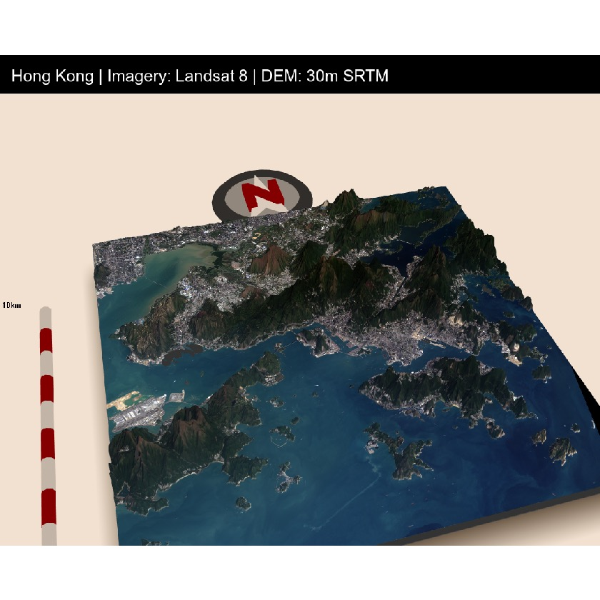

### Hi there 👋

  
 
🇭🇰
From Data Scientist that know a little bit of programming -> programmer that know a little bit of data science.

- 🔭 I’m currently working on data science/machine learning. I want to apply ML to solve real-world problem.  
- 📫 How to reach me: mediumnok@gmail.com  

Recently, I make this plot with R. (Haven't used R for quite some time.)

Plot with rayshader in R, data from USGS Landsat 8 + 30m resolution SRTM DEM data

# Some Developer Principles I Learnt over the years
Do

Don't
* TDD - **T**rust-**D**riven **D**evelopment (Don't Test, Don't Commit, Trust your colleagus and yourself)

# Things I want to read/learn in 2021:
I like to learn stuff about data science, how application is built around them, and any useful stuff that make data science easier

1. Design Data Intensive Application ✅
2. High Performance Python: Practical Performant Programming for Humans
3. System Design (https://github.com/donnemartin/system-design-primer)
4. Do some LeetCode - finished 200 Questions and can solve most medium level question comfortably.

